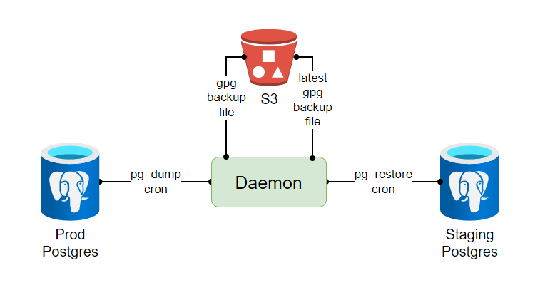

# pgdmpres


## Description



Schedule `pg_dump` and `pg_restore` operations using 1 container with full featured cron daemon written in Go.

## ToC

- [pgdmpres](#pgdmpres)
  - [Description](#description)
  - [ToC](#toc)
  - [How to use](#how-to-use)
  - [Configuration](#configuration)

## How to use

Use latest docker image configured by `env`

```bash
docker run --rm -d \
  -e S3_ENDPOINT=mys3.cloud \
  -e S3_BUCKET=backups \
  -e S3_PREFIX=prod \
  -e S3_ACCESS_ID=secret \
  -e S3_ACCESS_SECRET=secret \
  -e DUMP_POSTGRES_HOST=mypg.prod.cloud \
  -e DUMP_POSTGRES_USER=secret \
  -e DUMP_POSTGRES_PASSWORD=secret \
  -e DUMP_CRONTAB=@weekly \
  -e DUMP_ROTATE=24h \
  -e DUMP_GPG_PASSPHRASE=secret \
  -e RESTORE_ENABLED=true \
  -e RESTORE_GPG_PASSPHRASE=secret \
  mbigun/pgdmpres
```

To further more configure commands execution provide `comma separated list` of arguments through `DUMP_EXTRA_ARGS` and `RESTORE_EXTRA_ARGS` commands.
> NOTE: Reserved arguments will be ommited!
>
> List of reserved arguments:
>
> ```golang
> var reservedArgs []string = []string{
>  "-f", "--file",
>  "-F", "--format",
>  "-v", "--verbose",
>  "-V", "--version",
>  "-?", "--help",
>  "-d", "--dbname",
>  "-h", "--host",
>  "-p", "--port",
>  "-U", "--username",
>  "-w", "--no-password",
>  "-W", "--password",
>  "-l", "--list",
> }
> ```

## Configuration

| Environment variable           | Default value      | Description                                                                                         |
| ------------------------------ | ------------------ | --------------------------------------------------------------------------------------------------- |
| `LOGGER_LEVEL`                 | `"info"`           | Define application logging level                                                                    |
| `S3_ENDPOINT`                  | `"127.0.0.1:9000"` | S3 client connection server address                                                                 |
| `S3_USE_SSL`                   | `false`            | Whether to use SSL for S3 client connection                                                         |
| `S3_REGION`                    | `""`               | S3 client connection region                                                                         |
| `S3_BUCKET`                    | `""`               | S3 client connection bucket (where to store and retrieve backups)                                   |
| `S3_PREFIX`                    | `""`               | S3 client connection prefix                                                                         |
| `S3_ACCESS_ID`                 | `""`               | S3 client connection access ID (ignored if `S3_TOKEN` defined)                                      |
| `S3_ACCESS_SECRET`             | `""`               | S3 client connection access secret (ignored if `S3_TOKEN` defined)                                  |
| `S3_TOKEN`                     | `""`               | S3 client connection token                                                                          |
| `S3_TIMEOUT`                   | `""`               | S3 client connection timeout                                                                        |
| `DUMP_ENABLED`                 | `true`             | Enable `pg_dump` command job                                                                        |
| `DUMP_POSTGRES_HOST`           | `"127.0.0.1"`      | Postgres connection host for `pg_dump` command                                                      |
| `DUMP_POSTGRES_PORT`           | `5432`             | Postgres connection port for `pg_dump` command                                                      |
| `DUMP_POSTGRES_DB`             | `"postgres"`       | Postgres connection database for `pg_dump` command                                                  |
| `DUMP_POSTGRES_USER`           | `"postgres"`       | Postgres connection user for `pg_dump` command                                                      |
| `DUMP_POSTGRES_PASSWORD`       | `"postgres"`       | Postgres connection password for `pg_dump` command                                                  |
| `DUMP_INTERVAL`                | `"1h"`             | Run `pg_dump` command job with that interval (ignored if `DUMP_CRONTAB` defined)                    |
| `DUMP_CRONTAB`                 | `""`               | Run `pg_dump` command job with that cron schedule                                                   |
| `DUMP_CRONTAB_WITH_SECONDS`    | `false`            | If set as `true`, respects seconds mark in `DUMP_CRONTAB`                                           |
| `DUMP_TIMEOUT`                 | `"4s"`             | Execute `pg_dump` command with that timeout                                                         |
| `DUMP_GPG_PASSPHRASE`          | `""`               | If set, encrypts backup file with `gpg` using that passphrase                                       |
| `DUMP_ROTATE`                  | `""`               | If set, rotates existing backups in S3 bucket/prefix. Must be a valid duration string (eg. `"24h"`) |
| `DUMP_EXTRA_ARGS`              | `""`               | If set, adds extra arguments to `pg_dump` command (reserved arguments will be ommited)              |
| `RESTORE_ENABLED`              | `false`            | Enable `pg_restore` command job                                                                     |
| `RESTORE_POSTGRES_HOST`        | `"127.0.0.1"`      | Postgres connection host for `pg_restore` command                                                   |
| `RESTORE_POSTGRES_PORT`        | `5432`             | Postgres connection port for `pg_restore` command                                                   |
| `RESTORE_POSTGRES_DB`          | `"postgres"`       | Postgres connection database for `pg_restore` command                                               |
| `RESTORE_POSTGRES_USER`        | `"postgres"`       | Postgres connection user for `pg_restore` command                                                   |
| `RESTORE_POSTGRES_PASSWORD`    | `"postgres"`       | Postgres connection password for `pg_restore` command                                               |
| `RESTORE_INTERVAL`             | `"1h"`             | Run `pg_restore` command job with that interval (ignored if `RESTORE_CRONTAB` defined)              |
| `RESTORE_CRONTAB`              | `""`               | Run `pg_restore` command job with that cron schedule                                                |
| `RESTORE_CRONTAB_WITH_SECONDS` | `false`            | If set as `true`, respects seconds mark in `RESTORE_CRONTAB`                                        |
| `RESTORE_TIMEOUT`              | `"4s"`             | Execute `pg_restore` command with that timeout                                                      |
| `RESTORE_GPG_PASSPHRASE`       | `""`               | If set, decrypts backup file with `gpg` using that passphrase                                       |
| `RESTORE_EXTRA_ARGS`           | `""`               | If set, adds extra arguments to `pg_restore` command (reserved arguments will be ommited)           |
